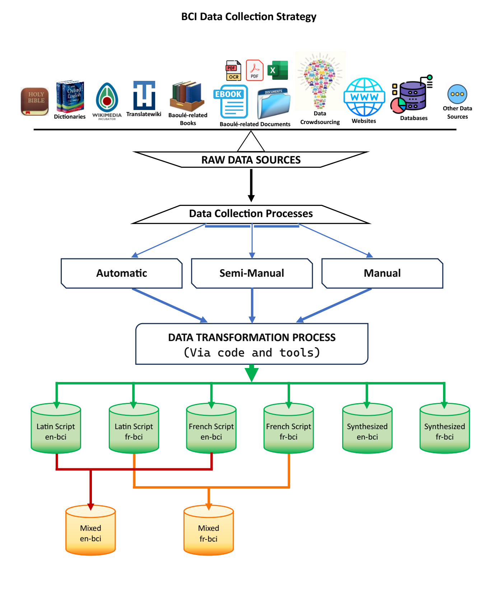

# The mtBCI-1.0-Corpus
A Baoulé mtBCI-1.0 Corpus for Machine Translation Tasks.

In our work, we created the mtBCI-1.0 Corpus, **a Baoulé related corpus for Machine Translation (MT) Tasks** via a thorough Data Engineering strategy, and we provided an evaluation on related baseline models, proving that the collected data is of scientific interest. 
We encourage professional and independent researchers, advanced students (master and Ph.D.), newbies, enthusiasts and hobbyists who are interested in contributing in the bci language expansion towards medium resource language and even more, to build upon the mtBCI-1.0 Corpus (make useful experimentations based on our initiative). They can work on related dataset improvement, on our proposed pairing platform (cf. APPENDICES of related paper) or on their own project, etc., and share their results to the research community. 
We so share some insightful files of our implementations in order to allow to any volunteer to contribute.   <br/>
**Related Paper :** https://aircconline.com/abstract/ijcsit/v16n5/16524ijcsit01.html. <br/>
**Proposed citation (formatted-mla) :**   <br/>
```
Konan Jean-Claude, Kouassi. (October 2024) “Baoulé Related Parallel Corpora for Machine Translation tasks: mtBCI-1.0.”
International Journal of Computer Science & Information Technology (IJCSIT), Vol. 16, No. 5, pp. 1-21,
Academy and Industry Research Collaboration Center (AIRCC), doi:10.5121/ijcsit.2024.16501.
```

For our usage, we split our mtBCI-1.0 corpus into several datasets or corpora:  <br/>
•	Latin-based script Datasets (**en-bci**, **fr-bci**); <br/>
•	French-based script Datasets (**en-bci**, **fr-bci**); <br/>
•	Mixed Datasets (**en-bci**, **fr-bci**), that is a mixture of Latin-based script and French-based script Datasets; <br/>
•	Synthesized Datasets (**en-bci**, **fr-bci**), that is a French-based synthesis of expressive and much more readable words, based on justified evidences. <br/>

## Open-ended contribution to bci-related Data Creation  <br/>
***BCI Wikimedia Incubator:*** https://incubator.wikimedia.org/wiki/Wp/bci.  <br/>
***BCI Translatewiki:*** https://translatewiki.net/, the bci language is mentioned here as wawle (Thank you very much to Amir Aharoni for the translation rights.)  <br/>
***Open-ended Data Crowdsourcing website:*** https://pairing.excellence-integration.org. <br/>



**The Full mtBCI-1.0-Corpus will be available upon validation of the related paper**, but without the dictionary data (we provided instead the section where this data has been extracted).
